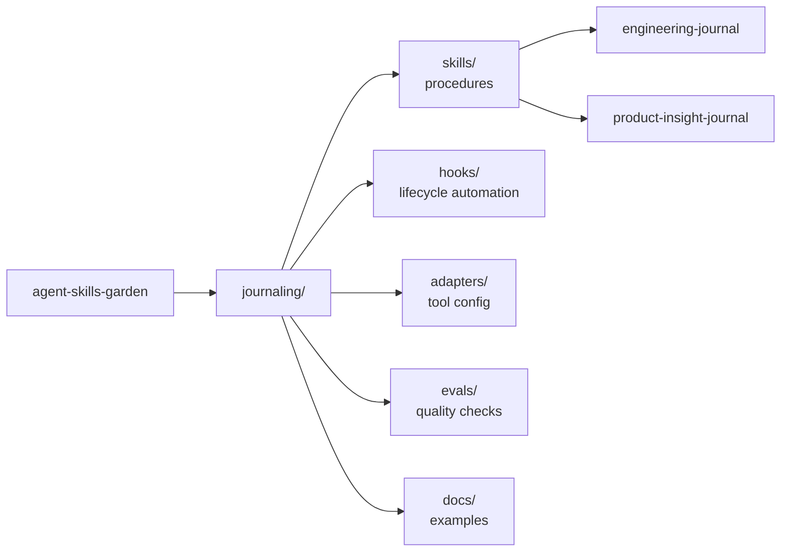

# agent-skills-garden

A personal collection of reusable agent skills built on the Agent Skills open
standard. Each top-level folder is self-contained and droppable into any
project or global skill directory.

---

## Skills in This Garden

| Skill | Status | Description |
|---|---|---|
| [`journaling/`](./journaling/) | ✅ v2.0 | Dual-journal system for engineering decisions and product insights |

**Inside `journaling/`:**

| Skill | Writes To | What It Captures |
|---|---|---|
| [`engineering-journal`](./journaling/skills/engineering-journal/SKILL.md) | `docs/dev_journal.md` | Architecture decisions, implementation pivots, debugging lessons, constraints, verification results, and engineering milestones |
| [`product-insight-journal`](./journaling/skills/product-insight-journal/SKILL.md) | `docs/product_insights.md` | User pain, UX friction, product hypotheses, positioning notes, roadmap trade-offs, trust risks, and growth or retention signals |

---

## How to Use These Skills

**Drop into a project:**
Copy the folder (e.g. `journaling/`) to your project root or to
`~/.claude/skills/` / `~/.codex/skills/`. Run the `scripts/` init script.
Follow the `adapters/` instructions for your tool.

**Reference from this repo:**
Point your CLAUDE.md or AGENTS.md at the skill path in this repo. Useful
during active development of a skill before it's been promoted to your
global install.

**Tool compatibility:**
All SKILL.md files follow the Agent Skills open standard (released by
Anthropic December 18, 2025, subsequently adopted by OpenAI Codex CLI,
Google Gemini CLI, GitHub Copilot, and Cursor). They work without
modification across all compliant runtimes. Hooks and adapters are
tool-specific and live in separate files.

---

## Research Foundation

This repo is built around one core premise: reliable agent skills are context
engineering artifacts, not just prompt snippets. The research points toward
four design constraints that shape the implementation here:

- **Progressive disclosure:** keep discovery metadata tiny, load full
  procedures only on activation, and keep rationale out of `SKILL.md`.
- **Externalized memory:** use journals and examples to preserve useful
  session knowledge outside the model context window.
- **Deterministic lifecycle hooks:** use shell hooks for capture points that
  should not depend on model attention, especially session end and compaction.
- **Eval-backed iteration:** treat journal quality and checkpoint detection as
  measurable behavior with explicit quality gates.

Sources and design rationale

This repo engages with the following body of work. These sources informed
the design of every skill here — particularly the context engineering
constraints, the Agent Skills architecture, the hook-layer integration
patterns, and the eval methodology.

### Context Engineering

**[Lost in the Middle: How Language Models Use Long Contexts](https://arxiv.org/abs/2307.03172)**
Liu et al., 2023
The foundational paper documenting U-shaped positional attention bias in
LLMs. Information at the start and end of context is attended to far more
reliably than information in the middle. Core implication for skill design:
important triggers and output format instructions must appear near the top
of any protocol file. Informs why SKILL.md files are short and front-loaded.

**[A Survey of Context Engineering for Large Language Models](https://arxiv.org/abs/2507.13334)**
Mei et al., 2025
Coined "context engineering" as the systematic discipline of curating what
enters the context window. Distinguishes four operations: writing, selecting,
compressing, and isolating information. The framework this repo uses to
think about skill file design.

**[Effective Context Engineering for AI Agents](https://www.anthropic.com/engineering)**
Anthropic, September 2025
Anthropic's formalization of context engineering as the primary design
discipline for reliable agents. Documented how agents processing large
codebases routinely exceed available context through sequential tool calls.

**[Context Rot and Long-Context Degradation](https://stackone.com/blog/agent-suicide-by-context)**
Chroma / StackOne, 2025
A Chroma study tested 18 frontier models and found every one degrades as
context fills, through lost-in-the-middle effects, attention dilution, and
distractor interference. Model correctness starts dropping after 32K tokens.
Motivates keeping SKILL.md files under ~200 lines.

**[Knowledge Activation: AI Skills as the Institutional Knowledge Primitive](https://arxiv.org/abs/2603.14805)**
2026
Documents the three constraints defining the context window economy: token
budget (hard limit), attention decay (effective capacity is smaller than
nominal), and latency cost (inference cost scales with context). Informs the
strict separation between skill instructions (SKILL.md, always lean) and
design rationale (README, never loaded by agents).

**[Externalization in LLM Agents: Memory, Skills, Protocols and Harness Engineering](https://arxiv.org/abs/2604.08224)**
2026
"Agentic memory stores what the agent learned; skills store how the agent
should act. Both keep information outside the context window until needed."
The conceptual foundation for the skill/journal split in this repo.

**[Less Context, Better Agents: Efficient Context Engineering](https://arxiv.org/abs/2606.10209)**
2026
Shows that for tool-heavy single-session workflows, a lightweight recency
window plus a compact running summary is sufficient — no external store or
retriever required. Informs the journal-as-external-memory design.

### Agent Skills Open Standard

**[Equipping Agents for the Real World with Agent Skills](https://www.anthropic.com/engineering)**
Anthropic Engineering, December 2025
The announcement and design rationale for Agent Skills. Introduced progressive
disclosure: name + description (~30–50 tokens) at discovery, full SKILL.md
on activation, referenced files and scripts only during execution.

**[Agent Skills Open Standard](https://agentskills.io)**
Released December 18, 2025
The official specification. Three-stage loading: Discovery → Activation →
Execution. The format this repo's SKILL.md files follow.

**[Progressive Disclosure as a System Design Pattern](https://swirlai.substack.com/)**
SwirlAI Newsletter, March 2026
"The SKILL.md file organizes information into three layers. The platform
implements the loading logic, deciding when to promote from one layer to the
next." Explains why the open standard achieved immediate cross-platform
adoption.

**[Configuration Smells in AGENTS.md Files](https://arxiv.org/abs/2606.15828)**
2026
Documents anti-patterns in agent configuration: context bloat, skill leakage,
conflicting instructions. Referenced in the skill authoring guidelines.

**[How to Build Your AGENTS.md](https://www.augmentcode.com/guides/how-to-build-agents-md)**
Augment Code, June 2026
An ETH Zurich study found LLM-generated context files reduced task success
rates ~3% and increased inference cost >20%. Human-curated files provided
a marginal 4% gain but still incurred token overhead. Justifies keeping
CLAUDE.md / AGENTS.md adapters under 15 lines.

### Hook-Layer Integration

**[Claude Code Hooks — Complete Guide](https://hidekazu-konishi.com/)**
Konishi, June 2026
Comprehensive reference for all Claude Code hook events, exit-code protocol,
tool matchers, and settings.json hierarchy.

**[All 30 Claude Code Hook Events](https://morphllm.com/claude-code-hooks)**
MorphLLM, June 2026
Documents the full event list including `SessionEnd` (receives `transcript_path`),
`PreCompact`, `PostCompact`, `TaskCreated`, and `TaskCompleted`.

**[SessionEnd vs Stop](https://github.com/luongnv89/claude-howto)**
luongnv89/claude-howto, 2026
"Stop fires after every Claude response. SessionEnd fires once when the
session terminates — exactly what you want for an end-of-session diary entry."
Informs the choice of `SessionEnd` (not `Stop`) for Claude Code journaling.

**[PreCompact and PostCompact Hooks](https://developersdigest.tech/)**
Developers Digest, April 2026
"PreCompact fires just before Claude summarizes older turns. It can block the
compaction, customize the summary strategy, or persist important context before
it gets condensed." Core hook used for compaction-boundary journal capture.

**[Claude Code Compaction and Long-Session Operations Guide](https://hidekazu-konishi.com/)**
Konishi, June 2026
"The PreCompact hook fires immediately before a compaction, with a matcher
that distinguishes manual (/compact) from automatic triggers." Documents
the exact integration pattern used in `pre-compact.sh`.

**[Claude Code Compaction Kept Destroying My Work](https://dev.to/adolan)**
Adolan, DEV Community, April 2026
Documents PreCompact + PostCompact as the production pattern for persistent
memory across compaction events, including the subshell pattern for making
PreCompact hooks crash-safe.

**[precompact-hook by mvara-ai](https://github.com/mvara-ai/precompact-hook)**
GitHub
"The hook fires at the death boundary — the moment between full context and
compaction. A subagent called from the hook has an empty context window,
meaning it can dedicate full attention to interpreting the session." Informed
the snapshot prompt design in `pre-compact.sh`.

**[Codex CLI Hooks Reference](https://developers.openai.com/codex/hooks)**
OpenAI Developers, April 2026
Codex supports the same hook event schema as Claude Code via `hooks.json`
or inline `config.toml`. `TaskCompleted` is a supported event alongside
`Stop`, `SessionStart`, `PreCompact`, and `PostCompact`.

**[Codex CLI v0.124.0 — Hooks Engine Stable](https://blakecrosley.com/guides/codex)**
Blake Crosley, June 2026
As of v0.124.0 (April 23, 2026) the Codex CLI hooks engine is marked stable.
New hook events continue to ship in releases.

**[Codex CLI Issue #17532](https://github.com/openai/codex/issues/17532)**
GitHub openai/codex, April 2026
Project-local `.codex/config.toml` hook config does not fire in interactive
sessions as of v0.120. Recommends global `~/.codex/hooks.json` until resolved.
Informs the adapter's installation note.

**[Claude Code vs Codex CLI 2026 Decision Reference](https://blakecrosley.com/blog/claude-code-vs-codex)**
Blake Crosley
Documents `TaskCreated` and `TaskCompleted` as confirmed Claude Code lifecycle
events (v2.1.141+), also available in Codex's hook schema. Confirms the
technical basis for `TaskCompleted`-based per-task checkpointing.

### Eval Methodology

**[LLM Agent Evaluation Metrics in 2026](https://www.confident-ai.com/)**
Confident AI, June 2026
Distinguishes agent tracing (what happened) from agent evaluation (whether
the right decisions were made). Covers tool calling, planning effectiveness,
task completion, and trajectory-level evaluation. Basis for the Level 4
behavioral eval design.

**[Rubric-Based Evals & LLM-as-a-Judge](https://medium.com/)**
Medium / Masood, April 2026
"Analytic rubrics score criterion-by-criterion. This is the cornerstone of
modern Eval Ops; it allows for regression root-cause analysis that a single
holistic score cannot provide." Basis for the five-dimension rubric in
`evals/rubric.md`.

**[LLM as a Judge — Primer and Pre-Built Evaluators](https://arize.com/llm-as-a-judge)**
Arize AI, 2026
"A judge model applies a written rubric to outputs and returns structured
scores. You define what 'good' looks like once; the judge applies it
consistently across thousands of traces." The pattern used in `eval-score.sh`.

**[LLM-as-judge for Multi-Step Agent Evaluation](https://medium.com/)**
Vinod Rane, Medium, May 2026
"Locking judge model versions is now a standard engineering requirement, not
optional. A model provider quietly updating the underlying LLM can change
scoring without any alert." Informs the judge model pinning requirement in
the Level 4 plan.

**[MCP-Bench: Benchmarking Tool-Using LLM Agents](https://arxiv.org/abs/2508.20453)**
arXiv
Uses an LLM-as-judge framework scoring across task completion quality, tool
selection rationale, and planning effectiveness. The judge is provided task
description, final solution, and summarized execution trace. Informs the
Level 4 behavioral eval methodology.

**[A Comprehensive Survey of Self-Evolving AI Agents](https://arxiv.org/abs/2508.07407)**
arXiv
Documents LLM-as-a-Judge in pointwise mode (scoring each output independently
against a rubric) as the standard for scalable evaluation. Notes that LLM
judges can correlate with human judgments, reaching inter-annotator agreement
levels in some domains.

### Product Discovery and Product Strategy

*(Informing the product-insight-journal skill)*

**[Continuous Discovery Habits](https://www.producttalk.org/category/continuous-discovery-habits/)**
Teresa Torres / Product Talk
Product insight should be tied to recurring user touchpoints and desired
product outcomes, not one-off feature ideas.

**[Opportunity Solution Trees](https://www.producttalk.org/opportunity-solution-trees/)**
Teresa Torres / Product Talk
Product notes should connect outcomes, opportunities, solutions, and
experiments. Informs the hypothesis and decision fields in the full schema.

**[Jobs to Be Done](https://www.christenseninstitute.org/jobs-to-be-done/)**
Christensen Institute
Product observations should capture the functional, social, and emotional
context behind user behavior. Informs the JTBD lens in the full entry schema.

**[Four Big Risks](https://www.svpg.com/four-big-risks/)**
Silicon Valley Product Group
Product observations should help de-risk value, usability, feasibility, and
business viability. Informs the Product Risk Lens field.

**[Feature Documentation Research](https://arxiv.org/abs/2208.01317)**
arXiv
Product-feature knowledge in GitHub projects is often fragmented and weakly
linked to implementation context. Motivates the dual-journal system with
explicit cross-referencing rather than a single mixed-concern log.

---

## Repo Philosophy

**Skills are procedures, not documents.** SKILL.md files contain only what
the agent needs to act. Design rationale and research live in READMEs that
agents never load.

**Hooks make reliability deterministic.** Model-driven journaling is
probabilistic. Hooks fire on every qualifying lifecycle event regardless of
model attention. The combination produces reliable coverage.

**Evals close the loop.** A skill without evals is a guess. Even a simple
Level 1 gate tells you whether the system is working session by session.
Level 2 rubric scoring tells you where it's weakest. The eval stack is part
of the skill, not an afterthought.

**Progressive disclosure keeps everything lean.** ~30–50 tokens at discovery,
full skill on activation, referenced files only during execution. This is
the Agent Skills contract and this repo honors it in every file.
