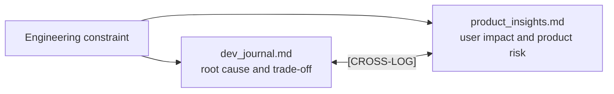
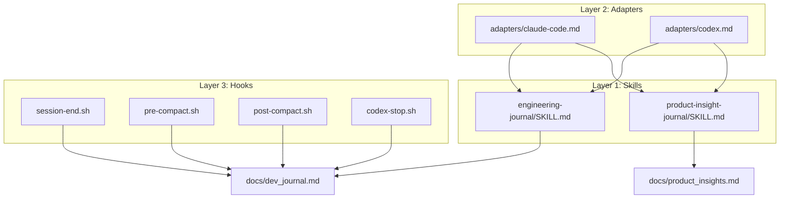
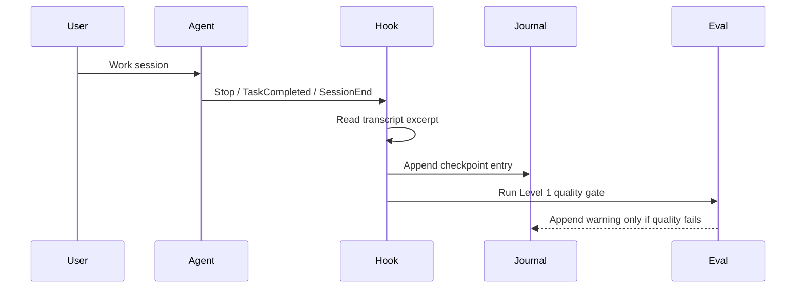

# journaling/

A self-contained dual-journal system for capturing engineering decisions and
product insights during agentic coding sessions. Drop this folder into any
project or reference it from `~/.claude/skills/` or `~/.codex/skills/`.

---

## What's Here

```
journaling/
├── README.md                               ← you are here (design rationale)
├── skills/
│   ├── engineering-journal/SKILL.md        ← engineering decisions protocol
│   └── product-insight-journal/SKILL.md    ← product insight protocol
├── hooks/
│   ├── session-end.sh                      ← Claude Code: fires at session end
│   ├── pre-compact.sh                      ← Claude Code: fires before compaction
│   ├── post-compact.sh                     ← Claude Code: fires after compaction
│   └── codex-stop.sh                       ← Codex: Stop + TaskCompleted events
├── adapters/
│   ├── claude-code.md                      ← CLAUDE.md block + hook registration
│   └── codex.md                            ← AGENTS.md block + hooks.json config
├── evals/
│   ├── rubric.md                           ← 5-dimension analytic scoring rubric
│   ├── eval-score.sh                       ← Level 2: on-demand rubric scorer
│   ├── level-4-plan.md                     ← Level 4 behavioral eval spec (planned)
│   └── golden/
│       └── golden-index.md                 ← Hand-labeled example dataset (stub)
└── scripts/
    └── journal-init                        ← initializes both journal files
```

---

## The Two Journals

The journaling skill keeps engineering memory and product memory separate so
each file stays useful to its audience. Engineering entries explain how the
system changed. Product entries explain what a user, market, or roadmap signal
means.

| Skill | Output File | Primary Question | Typical Signals |
|---|---|---|---|
| [`engineering-journal`](./skills/engineering-journal/SKILL.md) | `docs/dev_journal.md` | What changed technically, and why? | Architecture decisions, pivots, refactors, debugging, test strategy, constraints, integrations |
| [`product-insight-journal`](./skills/product-insight-journal/SKILL.md) | `docs/product_insights.md` | What did we learn about users, product value, or product risk? | UX friction, user pain, activation, retention, positioning, trust, roadmap, growth, feature hypotheses |

The hook layer currently automates engineering checkpoint capture at session
boundaries. Product insights are written by the product insight skill when the
session contains product, UX, growth, onboarding, retention, roadmap, or
user-facing work worth preserving.

**Engineering example:**

```markdown
### [CP-DEBUG] | 2026-06-20: Duplicate Hook Entry Suppressed

**Summary:** A Codex `Stop` event and `TaskCompleted` event were both writing
entries for the same task. The hook now tracks transcript size per session so
only new work is logged.

**Evidence:** Replayed the event path and confirmed one journal entry.
```

**Product example:**

```markdown
### [PI-UX-FRICTION] | 2026-06-20: Setup Instructions Hide the Actual Payoff

**Observation:** The README explains installation before showing what the
journaling skill produces.

**Why It Matters:** Readers evaluating the skill need to see the output shape
before they decide whether the setup is worth it.

**Hypothesis / Next Step:** If the README shows a compact example before the
install path, more readers will understand the value without opening the skill
files.
```

Some moments belong in both journals. If an engineering constraint changes the
user experience, write one entry in each file and connect them with a
`[CROSS-LOG]` marker.



---

## Three-Layer Design

```
Layer 1: Skill files   ← WHAT to log and HOW to format it (model reads this)
Layer 2: Adapters      ← WHERE to find the skills (CLAUDE.md / AGENTS.md)
Layer 3: Hooks         ← WHEN to write, deterministically (shell, not model)
```



The model layer is probabilistic — in-context attention degrades over long
sessions and near context limits. The hook layer is deterministic — it fires
on every qualifying lifecycle event regardless of model attention. Together
they produce reliable coverage without requiring constant manual logging or
prompt-level journaling instructions that burn context budget.

---

## Session Mapping by Tool

**Claude Code** (long single sessions):

| Event | Hook | Action |
|---|---|---|
| `PreCompact` | `pre-compact.sh` | Snapshot current progress before context is lost |
| `PostCompact` | `post-compact.sh` | Write resume marker for next context window |
| `SessionEnd` | `session-end.sh` | Full sweep of the session; runs Level 1 eval gate |

No mid-session prompting. No instruction to the model to journal during work.
The `PreCompact` hook closes the compaction gap — you can run `/compact` freely
without losing anything, because the hook fires before the context is erased.

**Codex CLI** (two modes — focused sessions and chained dispatches):

The `codex-stop.sh` hook handles both modes automatically based on the event
type it receives:

- `Stop` event + small transcript growth (< 2K chars) → write immediately
  (focused single-task session, treat as self-contained)
- `TaskCompleted` event → write one entry per completed task
  (chained dispatch mode, natural task boundaries)
- `Stop` event + large transcript growth → write full sweep on session exit

This means you don't need to configure anything differently between your two
usage patterns. The hook detects which mode it's in from the event type and
transcript growth.



---

## Eval Stack

| Level | What it measures | Cost | Runs |
|---|---|---|---|
| 1 — Passive gate | Output quality of each session's entries | ~200 tokens | Automatic, every session |
| 2 — Rubric scorer | 5-dimension analytic score on last N entries | ~500–800 tokens | Manual: `./evals/eval-score.sh` |
| 3 — Drift detection | Weekly trend across session scores | ~2K tokens/week | Planned |
| 4 — Behavioral evals | Skill checkpoint detection and classification accuracy | ~5–10K/run | Planned — see `evals/level-4-plan.md` |

Level 1 is embedded in the `SessionEnd` and `codex-stop.sh` hooks. It re-reads
each journal write immediately after appending and flags entries that don't
satisfy the quality bar with a `⚠ EVAL-FAIL` inline comment.

Level 2 uses an analytic rubric (five dimensions, 1–3 scale, pass threshold
2.0) evaluated by `claude-haiku-4-5`. Run it manually after a work block or
before extracting content for a write-up.

---

## Design Decisions and Why

### Why strip citations from SKILL.md?

SKILL.md files load on every activation under the Agent Skills progressive
disclosure model. Research bibliography content burns context budget and the
agent doesn't need it to do the job. Citations live here (skill README) and
in the repo-level README. The SKILL.md contains only procedural instructions.

Research basis: *Knowledge Activation: AI Skills as the Institutional
Knowledge Primitive* (2026) documents the three constraints defining the
context window economy — token budget, attention decay, and latency cost.
Every token in the SKILL.md that isn't procedural instruction is waste.

### Why hooks instead of prompt-level journaling?

Prompt-level journaling ("after each feature, write a journal entry") costs
context budget on every turn and competes with engineering work for attention.
Near context limits — exactly when journaling matters most — the model's
adherence to such instructions degrades. Hooks are deterministic shell
commands. They fire on every qualifying lifecycle event with zero context cost.

Research basis: *Claude Code Compaction Kept Destroying My Work* (DEV, 2026)
and *PreCompact and PostCompact Hooks* (Developers Digest, 2026) document
patterns for reliable state persistence across the compaction boundary.

### Why two journals instead of one?

Engineering decisions and product decisions answer different questions for
different audiences. Merging them into one file produces entries that are
too technical for product retrospectives and too vague for engineering
post-mortems. The `[CROSS-LOG]` marker connects entries that span both without
duplicating content across files.

Research basis: *Feature Documentation Research* (arXiv:2208.01317) finds
that product-feature knowledge in GitHub projects is often fragmented and
weakly linked to implementation context — a dual-journal system with explicit
cross-referencing addresses this directly.

### Why LLM-as-judge for evals?

Human review of journal entries doesn't scale across sessions. Code-based
evals can check structure but miss semantic quality — whether a decision was
actually explained, whether reasoning was present, whether evidence was
cited. LLM-as-judge applies a written rubric consistently across all entries.

Research basis: *Rubric-Based Evals & LLM-as-a-Judge* (Medium, 2026)
establishes that analytic rubrics (criterion-by-criterion scoring) enable
regression root-cause analysis in a way that holistic single-score approaches
cannot. *Arize AI — LLM as a Judge Primer* (2026) documents the pattern.

### Why Lightweight schema as a first-class option?

The full entry schema requires nine sections and non-trivial reasoning. At the
end of a long session when the model's context is most compressed, requiring
the full schema produces either forced entries or no entry at all. The
Lightweight schema (five fields) is good enough to reconstruct the engineering
story and can be completed reliably even in compressed contexts.

Research basis: *Lost in the Middle* (Liu et al., 2023) demonstrates U-shaped
positional attention bias — model attention to instructions degrades in long
contexts. *Context Rot* (Chroma, 2025) confirms every frontier model degrades
as context fills. Lightweight schema is the graceful degradation path.

### Why PreCompact for Claude Code but not mid-session prompting?

For the long-session Claude Code usage pattern, the only real gap in
SessionEnd-only coverage is context compaction — the model's context is
erased and SessionEnd doesn't fire until the session actually terminates.
PreCompact fires synchronously before every compaction and can write a
snapshot entry. This closes the gap without any mid-session prompt overhead.

Research basis: *Claude Code Compaction and Long-Session Operations Guide*
(Konishi, 2026) documents PreCompact as the correct hook point for
state-preservation before compaction, with the matcher distinguishing manual
(`/compact`) from automatic (context pressure) triggers.

### Why TaskCompleted for Codex dispatch chains?

In Codex's chained dispatch model, one "session" from the shell's perspective
may span five separate logical tasks. Waiting for session end means all five
tasks collapse into one journal entry, losing per-task granularity. The
`TaskCompleted` event fires at natural task boundaries — exactly where you
want checkpoints in a dispatch workflow — without any prompt-level overhead.

Research basis: Claude Code vs Codex CLI 2026 Decision Reference documents
`TaskCompleted` as one of the 27 Claude Code lifecycle events, confirmed as
also available in Codex's hooks schema.

---

## Installation Quickstart

```bash
# 1. Initialize journal files
./scripts/journal-init

# 2. Install Claude Code hooks
mkdir -p ~/.claude/hooks/journaling
cp hooks/session-end.sh ~/.claude/hooks/journaling/
cp hooks/pre-compact.sh ~/.claude/hooks/journaling/
cp hooks/post-compact.sh ~/.claude/hooks/journaling/
chmod +x ~/.claude/hooks/journaling/*.sh

# 3. Register in Claude Code settings
# Add to ~/.claude/settings.json — see adapters/claude-code.md

# 4. Install Codex hooks
mkdir -p ~/.codex/hooks/journaling
cp hooks/codex-stop.sh ~/.codex/hooks/journaling/
chmod +x ~/.codex/hooks/journaling/codex-stop.sh

# 5. Copy hooks.json — see adapters/codex.md

# 6. Copy AGENTS.md / CLAUDE.md adapter block
# See adapters/claude-code.md and adapters/codex.md

# 7. Install skill files
mkdir -p ~/.claude/skills/journaling
cp -r skills/engineering-journal ~/.claude/skills/journaling/
cp -r skills/product-insight-journal ~/.claude/skills/journaling/
```

---

## Extending This Skill

To add this to a new tool (Cursor, Gemini CLI, etc.):

1. Copy `skills/` to the tool's skill directory
2. Write a new adapter in `adapters/` for that tool's config format
3. Write a hook script in `hooks/` for that tool's lifecycle events
4. The SKILL.md files need no changes — they're already tool-agnostic
