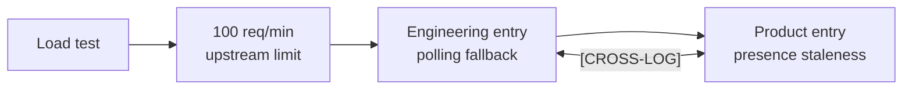

# Example Journal Entries

Two complete, full-schema entries showing what good output looks like from
each journal. Both are drawn from the same scenario — the API rate-limit
discovery documented as the golden example `t01` in
[`evals/golden/golden-index.md`](../evals/golden/golden-index.md) — so they
double as the readable reference for the Level 4 behavioral eval.

The scenario: a load test against a presence endpoint surfaced a 100
req/min-per-connection rate limit. The team chose a polling fallback over
switching to WebSockets. The engineering entry captures why the system
changed; the product entry captures why the change is user-visible. They are
cross-logged because both lenses are independently useful.



---

## Engineering Journal Entry — `dev_journal.md`

### [CP-CONSTRAINT] | 2026-06-19: Presence Endpoint Rate Limit Forces Polling Fallback

**The Context & Problem:**
Load testing the presence endpoint (`ab -n 500 -c 15`) at 15 concurrent users
surfaced a hard upstream limit: 100 requests/minute per connection. The test
saturated the limit in under 45 seconds, returning 412 failed requests with
`429 Too Many Requests`. The direct-call presence loop was not viable past a
small number of concurrent users.

**Design Decisions & Trade-offs:**
- **Choice:** Replace the direct per-user API call loop with a polling
  manager on a 5000ms interval plus jitter, keeping concurrent users safely
  under the rate limit.
- **Alternatives Considered:** Switching to a WebSocket-based presence
  channel, which would avoid the per-request rate limit entirely.
- **Why:** Polling was the smaller change and unblocks the current load
  immediately. WebSockets would remove the constraint but require a new
  connection-management layer; deferred rather than rejected.

**The Pivot/Revision:**
Original implementation called the presence API directly on a 500ms
interval per active user. That assumption broke under load — it was never
tested past a handful of concurrent users. Revised to a shared polling
manager rather than a per-user timer.

**Implementation Notes:**
- **Files/Modules Affected:** `src/presence/manager.ts`
- **Core Pattern Introduced:** `PollingPresenceManager` — a single
  5000ms-interval poller with jitter, replacing the per-user
  `setInterval(fetchPresence, 500)` loop.

**Verification & Evidence:**
Re-ran the same load test (15 concurrent users) after the change: zero 429
responses. Not yet validated at higher concurrency (20+ users) or over a
sustained multi-hour window — load test only, not a production observation.

**Documentation & References Utilized:** (none — limit discovered empirically via load test, not documented upstream)

**Code Snapshot/Diff Concept:**
```diff
- setInterval(fetchPresence, 500)  // one timer per active user
+ const manager = new PollingPresenceManager({ intervalMs: 5000, jitter: true })
+ manager.subscribe(userId, onPresenceUpdate)
```

**Cross-Log:** See `[PI-UX-FRICTION] | 2026-06-19: Presence Indicators Lag Behind Real-Time State` in `product_insights.md` — the 5s polling interval is the direct cause of the UX trade-off captured there.

**Open Questions / Follow-ups:**
- WebSocket-based presence deferred, not rejected — revisit if concurrency grows past current polling headroom.
- Untested above 20 concurrent users.

---

## Product Insight Journal Entry — `product_insights.md`

### [PI-UX-FRICTION] | 2026-06-19: Presence Indicators Lag Behind Real-Time State

**Observation:**
The polling fallback adopted to fix the presence-endpoint rate limit (see
cross-log) introduces a up-to-5-second delay before a user's presence status
updates for other users in the same session.

**User / Journey Context:**
- **User Segment:** Any user relying on real-time presence indicators (who's online/active).
- **Journey Stage:** Core workflow — ongoing collaboration/session use, not onboarding.
- **User Goal:** Trust that the presence indicator reflects who is actually active right now.

**Jobs-to-Be-Done Lens:**
- **Functional Job:** Know at a glance who else is currently present.
- **Emotional/Social Job:** Feel confident acting on presence info (e.g., not addressing someone who already left).

**Evidence:**
- **Source:** Implementation discovery — surfaced while fixing the rate-limit constraint, not from user reports yet.
- **Strength:** Medium
- **Notes:** Confirmed via load test that polling introduces up to 5s of staleness; not yet observed or reported by real users in production.
- **Counter-Evidence:** None identified.

**Product Impact:**
Could erode trust in presence indicators if a user appears "active" for up to 5 seconds after leaving, particularly in fast-moving concurrent sessions.

**Product Risk Lens:**
- **Primary Risk:** Trust
- **Why:** Presence is only useful if users believe it's accurate; a perceptible lag undermines that even if the underlying system is otherwise healthy.

**Hypothesis:**
If the 5s staleness is noticeable to users in practice, then trust in the presence indicator should degrade measurably versus the pre-rate-limit (near-real-time) experience — testable once in production.

**Decision / Next Step:**
Ship the polling fallback (engineering constraint leaves no near-term alternative) but flag the staleness window to product before wider rollout. Monitor for user-reported confusion; do not treat this as resolved.

**Priority Signal:**
- **Reach:** High (affects every concurrent session)
- **Impact:** Medium (degrades trust, doesn't block core functionality)
- **Confidence:** Medium (load-test confirmed mechanism, not yet user-validated)
- **Effort:** Unknown (depends on whether WebSocket migration is later pursued)

**Potential Content Angle:**
A concrete example of an engineering constraint creating a measurable, nameable product trade-off — useful for a case study on cross-functional trade-off communication.

**Cross-Log:** See `[CP-CONSTRAINT] | 2026-06-19: Presence Endpoint Rate Limit Forces Polling Fallback` in `dev_journal.md` — the rate limit and the 5s polling interval are the root cause of this friction.

**Open Questions:**
- Has any real user noticed or reported the staleness yet?
- Would a shorter polling interval (e.g. 2s) meaningfully reduce perceived staleness without re-approaching the rate limit?
